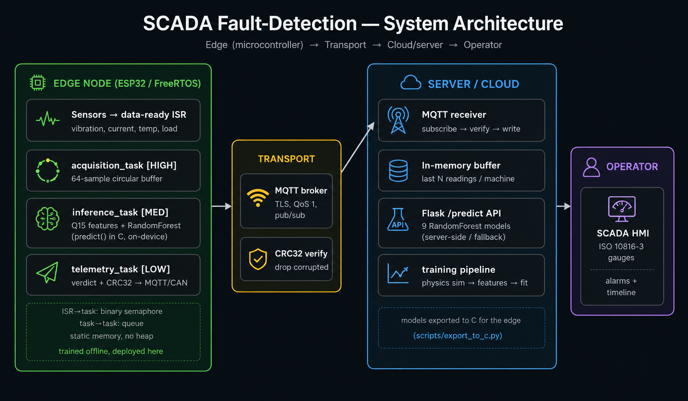
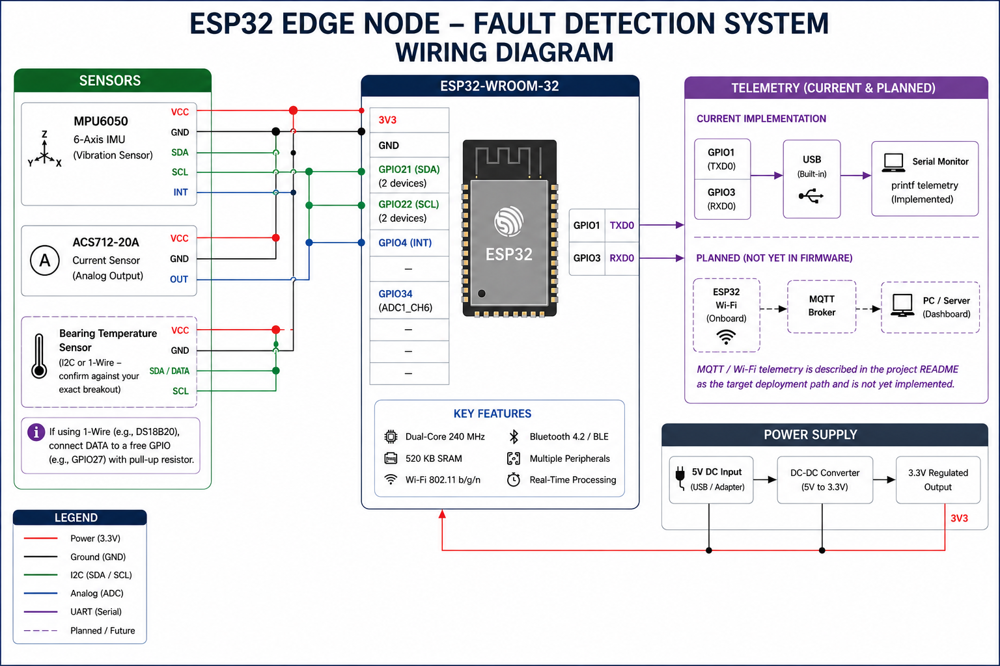

# Industrial SCADA Fault Detection: Motor, Pump, Compressor

An end-to-end predictive-maintenance pipeline for three industrial machines
(induction motor, centrifugal pump, reciprocating compressor). Physics-based
simulators generate sensor data, classifiers score machine health / fault
type / sensor health, and results surface on a SCADA HMI with ISO 10816-3
vibration gauges. The motor path also runs on physical ESP32/FreeRTOS
hardware with on-device inference, tested against a live compressor
(fault-detection accuracy is validated separately — see "Edge-AI variant").

**Highlights:**
- **97% accuracy, 0.97 macro-F1** on real CWRU bearing data, cross-load test
  (trained on 0/1/2 HP, tested on unseen 3 HP)
- **95%+ accuracy** distinguishing sensor failures from genuine machine
  faults across 3 simulated machines, out-of-distribution validated
- Found and fixed a data-leakage bug in the fault generator; a follow-up
  experiment isolated the real cause of the remaining generalization gap
- Full sensing-to-telemetry pipeline verified on physical ESP32 hardware

## Architecture



Models train offline, export to C, and run inference inside a FreeRTOS task
on the edge node. Verdicts publish over MQTT with a CRC32 check and land in
a rolling in-memory buffer for the HMI. A Flask API mirrors the same model
for development and as a fallback. Storage is in-memory for now (last N
readings per machine); a production deployment would swap in a time-series
DB behind the same `add()`/`history()` interface.

## What it does

- Simulates three machines from datasheet physics (slip, affinity laws
  `Q∝N, H∝N², P∝N³`, isentropic compression) with progressive fault
  injection. Equations in [`docs/PHYSICS.md`](docs/PHYSICS.md).
- Engineers 12 features (raw sensors + rolling stats + rate-of-change +
  operating-point context) from one module shared by training and serving.
- Trains 9 RandomForest classifiers (3 machines × health / fault-type /
  sensor-health).
- Validates the motor path on **real** CWRU bearing data
  ([`docs/CWRU.md`](docs/CWRU.md), `training/cwru_motor.py`); pump and
  compressor stay physics-simulated.
- Verifies telemetry integrity with CRC32 before trusting it.
- Shows live status on a SCADA HMI with ISO 10816-3 severity zones.

## Tech stack

Python · scikit-learn · Flask · MQTT (paho) · Streamlit · Plotly ·
C / FreeRTOS (edge node) · micromlgen (model→C export)

## Results

**Synthetic data, two numbers per classifier:**

| classifier | in-distribution | cross-instance (fresh seed) |
|---|---|---|
| motor_health | 90.0% | 74.4% |
| motor_faulttype | 88.0% | 69.0% |
| motor_sensorhealth | 95.0% (F1 0.82) | 95.6% (F1 0.72) |
| pump_health | 97.5% | 97.9% |
| pump_faulttype | 97.1% | 97.9% |
| pump_sensorhealth | 95.2% (F1 0.89) | 96.4% (F1 0.80) |
| compressor_health | 90.9% | 71.8% |
| compressor_faulttype | 87.9% | 67.2% |
| compressor_sensorhealth | 95.9% (F1 0.89) | 95.8% (F1 0.72) |

*In-distribution* = held out by `run_id` from the same generator run.
*Cross-instance* = scored against a completely fresh simulation (different
seed, zero shared rows). Reproduce:
`python -m simulator.generate_data --rows 50000 --n-runs 10` then
`python -m training.train_models --data-dir training_data --out-dir models --check-seed 999`.

Pump and the three sensor-health classifiers generalize well (gap ≈0) —
cavitation, dry-running, and stuck/out-of-range readings are strong enough
signals to survive a fresh noise realization. Motor and compressor
health/fault-type detection don't (15–21 point gap): traced to the fault
generator building each class from one continuous simulation run, fixed by
generating multiple independent runs per class and splitting by `run_id`
instead of row-chunk. A follow-up test (raised sensor noise, continuous
fault severity, unit-to-unit variance) ruled out noise as the remaining
cause — both columns dropped together and the gap held — which points to
training-instance count as the actual bottleneck. Next: higher `--n-runs`.

Figures above are on physics-simulated data, not field data. Feature
importance leans on vibration RMS and kurtosis for bearing faults,
consistent with the underlying physics.


**CWRU real-data: 97% accuracy, 0.97 macro-F1.** Cross-load test — trained
on HP loads 0/1/2, tested on an entirely unseen HP 3 (stronger than a
within-file split; see [`docs/CWRU.md §7`](docs/CWRU.md)). 64 files (Normal + 12k Drive-End),
file labels verified against CWRU's own published tables, split checked
against file/load leakage before training.

| class | precision | recall | f1 | support |
|---|---|---|---|---|
| ball | 0.92 | 0.97 | 0.95 | 470 |
| inner_race | 0.96 | 0.98 | 0.97 | 471 |
| normal | 1.00 | 1.00 | 1.00 | 473 |
| outer_race | 1.00 | 0.95 | 0.97 | 825 |

## Quickstart

```bash
git clone <your-repo-url> && cd scada-fault-detection
python -m venv .venv && source .venv/bin/activate
pip install -r requirements.txt
cp .env.example .env          # fill in MQTT broker creds

# 1) generate data -> training_data/*.csv
python -m simulator.generate_data --rows 50000 --n-runs 10
# 2) train, then stress-test on a freshly-simulated dataset (different seed)
python -m training.train_models --data-dir training_data --out-dir models --check-seed 999
# 3) serve the API
python -m api.ml_api
# 4) launch the HMI (separate terminal)
streamlit run dashboard/scada_app.py
# 5) optional live telemetry path: MQTT receiver -> in-memory store
python -m receiver.mqtt_receiver
```

Validate the motor on real CWRU bearing data (see [`docs/CWRU.md`](docs/CWRU.md)):

```bash
pip install scipy
# within-file split (docs/CWRU.md §5-6)
python -m training.cwru_motor --data-dir data/cwru --out-dir models --plot
# cross-load split: train on 0/1/2 HP, test on unseen 3 HP (docs/CWRU.md §7)
python -m training.cwru_motor --crossload-dir <path-to-dataset> --test-hp 3 \
    --out-dir models --skip-within-file
```

Run the experiments that back the claims:

```bash
python -m scripts.crc32_experiment      # CRC32 detection rate (measured)
PYTHONPATH=. pytest -q                   # test suite
```

## Edge-AI variant

The server side is supporting infrastructure — the point of this project is
inference on the device, not in the cloud.

```bash
pip install micromlgen
python -m scripts.export_to_c \
    --model models/motor_health_model.joblib \
    --out edge_firmware/include/motor_health_model.h --name MotorHealthModel
```

[`edge_firmware/docs/BUILD_QEMU.md`](edge_firmware/docs/BUILD_QEMU.md) builds
and runs the FreeRTOS node under QEMU, no hardware needed. `edge_firmware/src/`
is fully implemented: three FreeRTOS tasks (acquisition / inference /
telemetry), a Q15 fixed-point feature pipeline matching the Python
`FEATURE_ORDER`, CRC32 framing the MQTT receiver verifies byte-for-byte.

**Hardware status: run on a physical ESP32** against a live compressor —
real sensors, timing, and telemetry, not QEMU's simulator. Confirms the
pipeline (acquisition → features → inference → CRC32 telemetry) works
end-to-end under real sensor noise. Does not confirm live fault detection —
the demonstration unit stayed healthy for the whole run, so no fault
condition was ever present to classify; fault-detection accuracy is
validated separately against CWRU data and the synthetic simulator (see
Results). `edge_firmware/bench/` reproduces the fixed-point arithmetic and
latency/footprint numbers on any machine, no hardware required — see
[`edge_firmware/docs/MEASUREMENTS.md`](edge_firmware/docs/MEASUREMENTS.md).




## Repository layout

```
config/         shared settings + secrets-from-env
simulator/      physics-based machine simulators (generate_data.py)
training/       feature_engineering.py (shared), train_models.py, cwru_motor.py
api/            Flask inference service
receiver/       MQTT -> CRC32 verify -> in-memory store
dashboard/      Streamlit SCADA HMI
edge_firmware/  ESP32/FreeRTOS edge node (implemented; QEMU guide + host bench)
scripts/        crc32_experiment, export_to_c
tests/          pytest suite
docs/           PHYSICS.md, CWRU.md, INSTRUMENTS.md, results/, diagrams/
```
